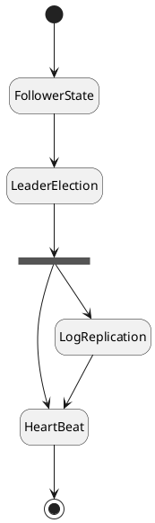
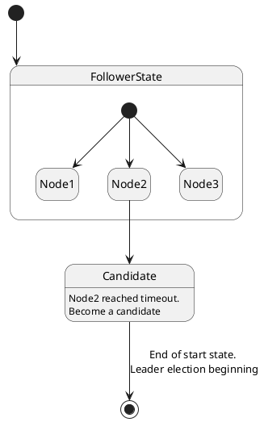
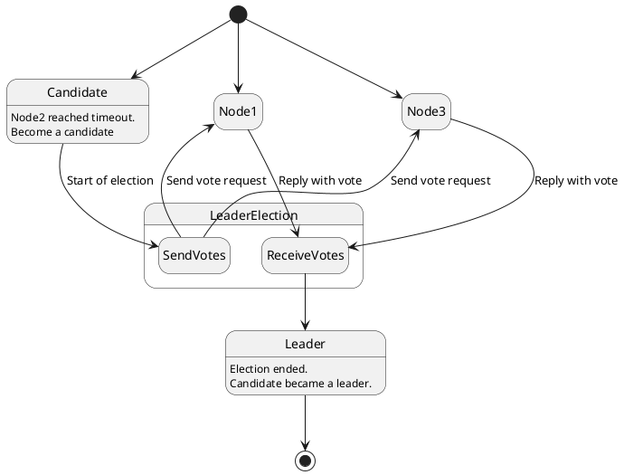
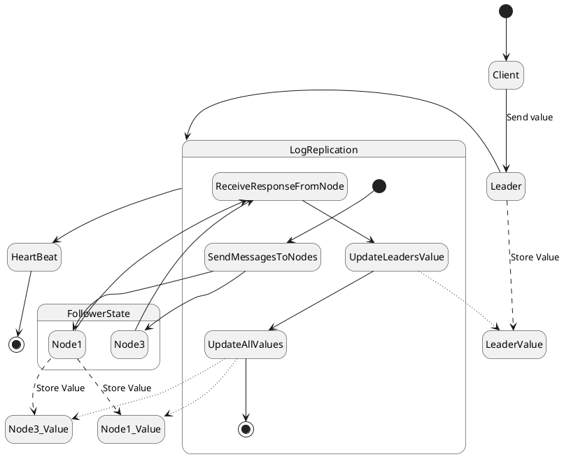

//All states

```plantuml
@startuml
hide empty description

[*] --> FollowerState
state LeaderElected <<fork>>
FollowerState --> LeaderElection
LeaderElection --> LeaderElected

LeaderElected --> HeartBeat
LeaderElected --> LogReplication

LogReplication --> HeartBeat
HeartBeat --> [*]

@enduml

```

//Follower state

```plantuml

@startuml
hide empty description

[*] --> FollowerState

state FollowerState {
 [*] --> Node1
 [*] --> Node2
 [*] --> Node3

}
 Node2 --> Candidate
 Candidate : Node2 reached timeout. \nBecome a candidate

 Candidate --> [*] : End of start state. \nLeader election beginning

@enduml

```

//Leader election

```plantuml

@startuml
hide empty description

[*] --> Candidate
[*] --> Node1
[*] --> Node3

state Candidate
Candidate : Node2 reached timeout.\nBecome a candidate

state LeaderElection {
 state SendVotes
 state ReceiveVotes


}
Candidate --> SendVotes : Start of election
SendVotes --> Node1 : Send vote request
SendVotes --> Node3 : Send vote request

Node1 --> ReceiveVotes : Reply with vote
Node3 --> ReceiveVotes : Reply with vote

state Leader : Election ended.\nCandidate became a leader.
ReceiveVotes --> Leader

Leader --> [*]
@enduml

```

//Log replication

```plantuml

@startuml
hide empty description

Leader -[dashed]-> LeaderValue : Store Value
state FollowerState {
 state Node1
 state Node3

}
Node1 -[dashed]->Node1_Value : Store Value
Node1 -[dashed]->Node3_Value : Store Value

[*] --> Client

Client --> Leader : Send value

state LogReplication {
    [*] --> SendMessagesToNodes
    state ReceiveResponseFromNode
    state UpdateLeadersValue
    state UpdateAllValues
    UpdateAllValues --> [*]
}

Leader -> LogReplication
SendMessagesToNodes --> Node1
SendMessagesToNodes --> Node3

Node1 --> ReceiveResponseFromNode
Node3 --> ReceiveResponseFromNode

ReceiveResponseFromNode --> UpdateLeadersValue

UpdateLeadersValue -[dotted]-> LeaderValue
UpdateLeadersValue --> UpdateAllValues

UpdateAllValues -[dotted]-> Node1_Value
UpdateAllValues -[dotted]-> Node3_Value


LogReplication --> HeartBeat
HeartBeat --> [*]

@enduml

```

