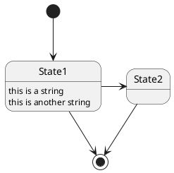
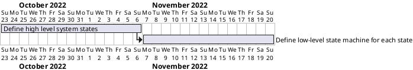

* Визначити стейти системи
  * eg Leader election

```plantuml

@startuml

[*] --> State1
State1 --> [*]
State1 : this is a string
State1 : this is another string

State1 -> State2
State2 --> [*]

@enduml

```

    * ...

switch State::A:

```plantuml

@startgantt

Project starts 2022-10-23
[Define high level system states] lasts 15 days
[Define low-level state machine for each state] lasts 14 days
[Define high level system states] -> [Define low-level state machine for each state]

@endagantt

```
